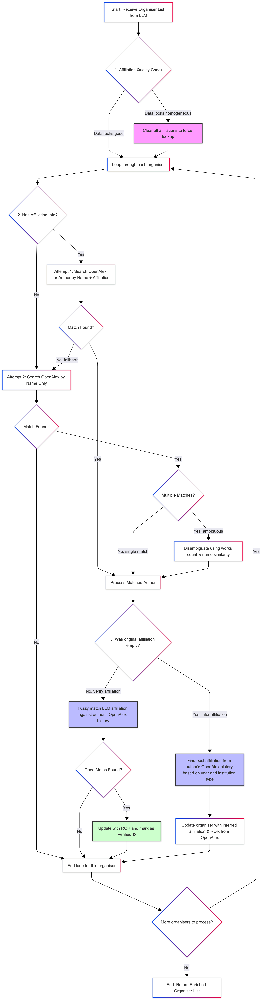

# Conference Organisers and Content Identifier
 
 The **Conference Organisers and Content Identifier** is an AI-driven tool designed to streamline the process of extracting critical information from academic **Call for Papers (CfPs)**. This tool automates the tedious task of manually parsing documents to identify conference details, series, locations, and, most importantly, organising committee members, and the topics of interest.
 
 By using cutting-edge AI technology, this tool saves researchers and administrators countless hours, allowing them to quickly access and analyse key data points about academic events and their organisers. The tool works by taking a CfP as input and outputting a structured JSON object, making the data easily searchable, shareable, and integrable with other systems.
 
- [Conference Organisers and Content Identifier](#conference-organisers-and-content-identifier)
    - [Key Data Extracted](#key-data-extracted)
    - [Organiser Details](#organiser-details)
    - [Integration and Data Mapping](#integration-and-data-mapping)
    - [Organiser Matching Process](#organiser-matching-process)
    - [Rebranding COCI](#rebranding-coci)
    - [How to use it](#how-to-use-it)

 ---
 
 ### Key Data Extracted
    
The tool is built to recognise and extract the following core components from a CfP:

- **`event_name`**: The full, official title of the conference or workshop.
- **`conference_series`**: The name of the recurring conference series, without the year or edition number.
- **`event_acronym`**: The short, official acronym for the event (e.g., "ICML," "CHI").
- **`colocated_with`**: If the event is held in conjunction with another larger event, this field captures that information.
- **`year`**: The year in which the event takes place.
- **`location`**: The specific city or location where the event is scheduled to take place.
- **`organisers`**: An array of objects, each containing detailed information about a committee member.

---

### Organiser Details

Within the `organisers` array, the tool provides a rich set of information for each individual:

- **`organiser_name`**: The full name of the organiser.
- **`organiser_affiliation`**: The academic institution or company the organiser is affiliated with. Verified affiliations are marked with a star (✪).
- **`organiser_country`**: The country of the organiser's affiliation, if available.
- **`track_name`**: The specific track or area of the conference the organiser is involved in. For single-track events, the default value is 'main'.

### Integration and Data Mapping

To further enrich the extracted information, the **{st.session_state['config']['APP']['app_name']}** integrates with several well-known academic databases.

- **OpenAlex**: Organiser names are mapped to OpenAlex, a global, open index of scholarly literature and researchers. This allows the tool to identify additional identifiers like **ORCIDs** and **RORs** (Research Organisation Registry identifiers) for institutions.
- **DBLP, AIDA Dashboard, and Conference ConfIDent**: Conference details are mapped to these databases to provide a comprehensive view of the event's history and relevance within the scientific community.

---

### Organiser Matching Process

The tool employs a sophisticated multi-stage process to match extracted organisers with their OpenAlex profiles:

1. **Quality Check**: First, the system evaluates the provided affiliations for diversity. If they appear too homogeneous (suggesting a default value), they are discarded to force a broader search.
2. **Profile Search**:
    - **Affiliation-Based**: The system attempts to locate the author within their specific institution in OpenAlex.
    - **Name-Based Fallback**: If the affiliation search fails, it searches by name, using publication count and name similarity to identify the most likely candidate.
3. **Verification and Enrichment**:
    - **Verification**: If an affiliation was provided, it is cross-referenced with the author's publication history. Validated matches are marked with a star (✪).
    - **Inference**: If no affiliation was provided, the system infers the most likely current affiliation based on recent publication history.
    - **ID Extraction**: Finally, ORCID and ROR (Research Organization Registry) identifiers are retrieved.

Here is the flowchart:




 

### Rebranding COCI
_(note from 10 Feb 2026)_

By simply changing "Organising Committee" to "Organisers and Content", we have shifted the focus from a narrow group of people to a broader spectrum of information without losing the brand equity of COCI.
    

 ### How to use it

 Create a virtual environment using python 3.13 (it has been tested only with this version). In a terminal, please run the following command:

```python -m venv /path/to/new/virtual/environment```

Otherwise, refer to (https://docs.python.org/3/library/venv.html)[https://docs.python.org/3/library/venv.html] on how to create a virtual environment. 

Activate the new environment:

```$ source /path/to/new/virtual/environment/bin/activate```

Install requirement (from the repository):

```$ pip install -r /path/to/requirements.txt```

And finally, within a python shell, run the code via Streamlit:

```streamlit run COCI.py```